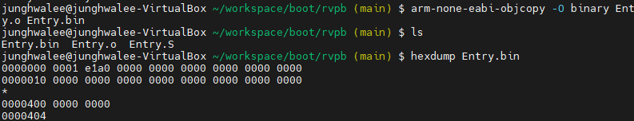
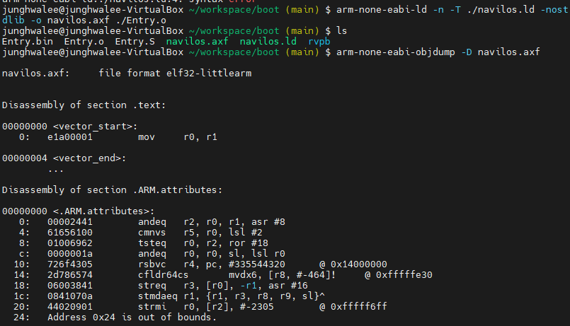
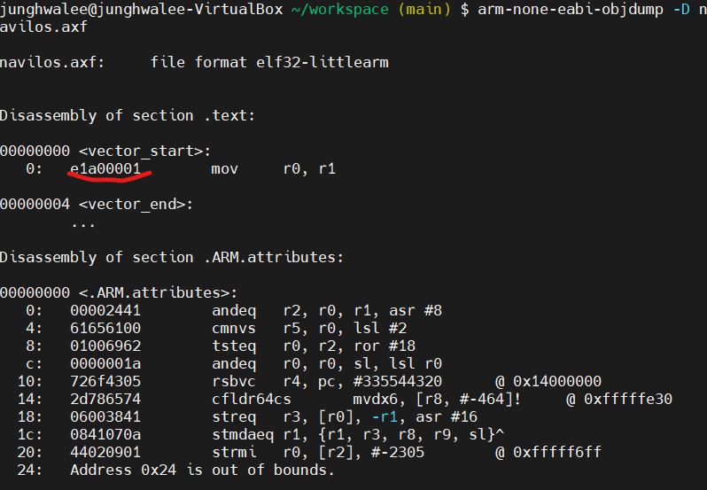
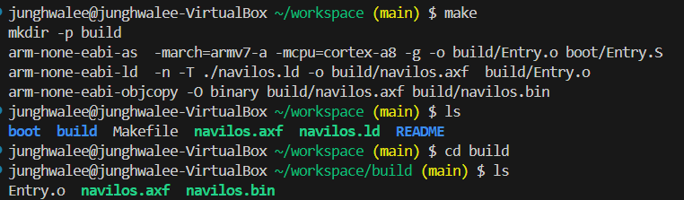
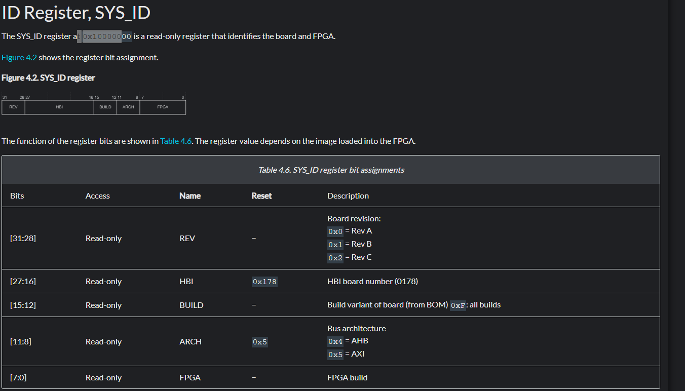
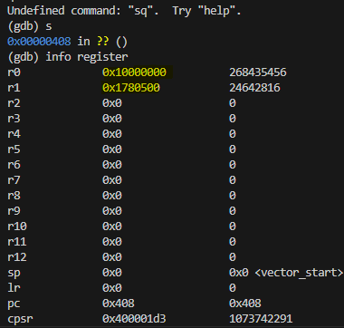

# 3. 시작하기
### 3.1 리셋 벡터  
-> 리셋 벡터는 메모리주소 `0x00000000`  
-> ARM코어는 전원이 들어오면 가장 먼저 메모리  주소 0x00000000에서 32bit를 읽어서 명령 바로 실행  

```asm
.text
    .code 32 // 명령어 크기 32 bit

    .global vector_start
    .global vector_end

    vector_start:
      MOV  R0, R1 // R0, R1 : 레지스터
    vector_end:
      .space 1024, 0 // 해당 위치부터, 1024 바이트를 0으로 채워라
.end // text 섹션 끝
```

`.text` : text 섹션 (실행파일에서 코드를 바이너리로 변경해서 모아 놓은 것)
* 실행파일: SW를 구성하는 요소를 파일 시스템에 바이너리로 만든 것  

`.code` : 명령어의 크기 32bit  
`.global` : extern와 같은 의미  
-> `vector_start`, `vector_end` 는 주소 정보를 외부 팡리에서 심벌로 읽을 수 있게 설정  

✅ **Entry.S를 어셈블리어로 컴파일한 후 바이너리 덤프** 
`$arm-none-eabi-as -march=armv7-a -mcpu=cortex-a8 -o Entry.o ./Entry.S`   
: 어셈블리어 소스파일 컴파일  
-> cortex-A8이라 아키텍처 armv7-a로 설정  
-> cpu는 cortex-a8로 설정  

`$ arm-none-eabi-objcopy -O binary Entry.o Entry.bin`  
: Entry.o 오브젝트 파일에서 바이너리만 추출하여 Entry.bin 파일 생성

`$ hexdump Entry.bin`  
: hexdump로 binary 내용 확인


-> `0001 e1a0` : 기계어로 MOV R0, R1  
`*` : 계속 반복되는 값을 표시하지않고 앞의 값이 계속 0  

ARM은 4byte로 메모리 주소를 관리하므로,  
`MOV  R0, R1`(4byte) + `.space 1024, 0 `(1024byte) = 0x0000404(=1028byte)  

### 3.2 실행 파일 만들기  
QEMU가 펌웨어 파일을 읽어서 부팅하려면 입력으로 지정한 펌웨어 바이너리 파일이 ELF 파일 형식이어야함!
* `ELF파일`: 실행 파일, 오브젝트 파일, 라이브러리 등을 표현하는 사용되는 파일 포맷 (리눅스 및 유닉스 계열 OS에서 사용)  
-> 링커나 로더가 프로그램 실행에 필요한 여러 정보를 포함하고 있는 ELF 파일을 처리하여 프로그램 실행하도록 도와줌! (=ELF 파일 만들려면 링커 필요)
 - `링커` : 여러 오브젝트 파일을 묶어서 하나의 실행 파일로 만들어주는 프로그램

`링커 스크립트` : 링커 동작 시키기 위해, 링커에게 정보를 던져주는 파일  
-> 펌웨어를 개발할 때는 펌웨어가 동작하는 HW 환경에 맞춰서 링커 스크립트로 링커의 동작을 제어하여 원하는 형태의 ELF 파일 생성함  

👉 navilos.ld
```
ENTRY(vector_start) // 시작 위치의 symbol
SECTIONS
{
    . = 0x0; // 첫번째 섹션이 메모리 주소 0x00000000에 위치

    .text : // text 섹션의 배치 순서(시작 주소부터 순서대로)
    {
        *(vector_start) // 리셋벡터 위치
        *(.text .rodata)
    }
    .data : // data 섹션
    {
        *(.data)
    }
    .bss : // bss 섹션 
    {
        *(.bss)
    }
}
```  
✅ **링커로 실행 파일 만들기**
  

`$arm-none-eabi-ld -n -T ./navilos.ld -nostdlib -o navilos.axf ./Entry.o`  
: `Entry.o` 파일을 입력으로 받아서, 링커 스크립트 `navilos.ld`를 참고하여 표준 라이브러리 없이 ARM 아키텍처용 실행 파일 생성  

`-n`: 링커에 섹션의 정렬 자동으로 맞추지 말라고 지시  
`-T`: 링커 스크립트의 파일명을 알려주는 옵션  
`-nostdlib`: 표준 라이브러리를 사용하지 않도록 설정  
`.axf` : ARM Executable 파일 포맷-> 임베디드 시스템에서 실행 가능한 바이너리 파일로 사용 가능

`$arm-none-eabi-objdump -D navilos.axf`  
: navilos.axf 실행 파일의 디스어셈블리를 출력  
-> `MOV  R0, R1`의 기계어 = `0xe1a00001`


✅ **QEMU로 실행하기**

`gdb-multiarch navilos.axf` : navilos.axf 실행파일 열어 디버깅  

`sudo apt install libgtk-3-dev` : qemu gui 설치  

👉QEMU 실행  

`qemu-system-arm -M realview-pb-a8 -kernel navilos.axf -S -gdb tcp::1234` : qemu realview-pb-a8 타겟 보드로 navilos.axf 바이너리 파일 펌웨어나 커널로 로드해서 실행  
-> -S: gdb붙을 때까지 아무 동작 안함  
-> 포트 1234에 gdb 서버 open  

`gdb-multiarch` : gdb 실행  
-> gdb안에서 `target remote:1234` : qemu랑 원격 연결  

*실행 결과*  
    
  -> 주소0에서 부터 시작해, 4개의 워드를 16진수로 보여주라는 결과, disamble했던 0xe1a0001과 동일함을 확인  
    
  -> 디어셈블리 해서 보면 동일함을 확인  


✅ **빌드 자동화하기**  
-> Makefile 작성  
```makefile
ARCH = armv7-a
MCPU = cortex-a8

# toolchain : 크로스 컴파일에 관여하는 유틸리티들
CC = arm-none-eabi-gcc
AS = arm-none-eabi-as 
LD = arm-none-eabi-ld 
OC = arm-none-eabi-objcopy

LINKER_SCRIPT = ./navilos.ld

ASM_SRCS = $(wildcard boot/*.S)
# 확장자 S인 파일을 모두 찾아 object로 변경 및 디렉터리도 build로
ASM_OBJS = $(patsubst boot/%.S, build/%.o, $(ASM_SRCS))

navilos = build/navilos.axf
navilos_bin = build/navilos.bin

.PHONY: all clean run debug gdb

all: $(navilos)

clean:
	@rm -fr build

run: $(navilos)
	qemu-system-arm -M realview-pb-a8 -kernel $(navilos)

debug: $(navilos)
	qemu-system-arm -M realview-pb-a8 -kernel $(navilos) -S -gdb tcp::1234

gdb:
	gdb-multiarch

$(navilos): $(ASM_OBJS)	$(LINKER_SCRIPT)
	$(LD) -n -T $(LINKER_SCRIPT) -o $(navilos) $(ASM_OBJS)
	$(OC) -O binary $(navilos) $(navilos_bin)

build/%.o: boot/%.S
	mkdir -p $(shell dirname $@)
	$(AS) -march=$(ARCH) -mcpu=$(MCPU) -g -o $@ $<


```
  

-> make 자동화 성공 (build 폴더 생성)  


✅ **하드웨어 정보 읽어오기 - 데이터 시트 읽는 방법**  
하드웨어에서 정보를 읽어오고 정보를 쓰기 위해서는 `레지스터`를 활용 !
* 레지스터 : 하드웨어가 소프트웨어와 상호작용하는 인터페이스  
  
*Datasheet Site*  
https://developer.arm.com/documentation/dui0417/d/programmer-s-reference/status-and-system-control-registers/id-register--sys-id?lang=en  
-> SYS_ID : 보드의 ID 정보를 담고 있는 읽기 전용 레지스터  
  

- 실습
R0: ID register(SYS_ID)  
-> R1에 R0의 하드웨어 정보 읽어서 담기  
```asm
.text
    .code 32

    .global vector_start
    .global vector_end

    vector_start:
      LDR R0, = 0x10000000
      LDR R1, [R0]
    vector_end:
      .space 1024, 0
.end
```
*실행 결과*

-> r0 = 0x10000000 주소에 값을 읽어 r1에 넣음! 보드 이름에 따른 0x178 ... 값 나온 것 확인
