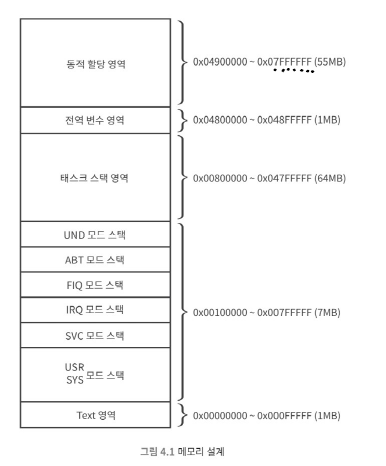
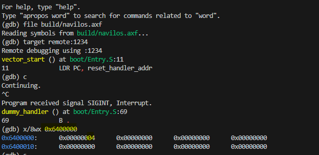

# 4. 부팅하기
-> 시스템에 전원이 들어가고 ARM코어가 리셋 익셉션 핸들러까지 모두 처리한 것을 부팅이라 정의  
### 4.1 메모리 설계   
-> 기본 QEMU는 128MB 할당  

👉 **실행 파일 형식 메모리**  
- `text` : 코드가 있는 공간  
-> 주로 빠른 메모리에 배치 (RTOS에서는 주로 수십 KB 정도면 충분)
- `data` : 초기화된 전역 변수  
-> 전역 변수 선언할 때 초기 값을 할당해서 선언하면 해당 전 역 변수는 data 영역에 점유  
- `BSS` : 초기화 되지 않은 전역 변수  

```메모리 설계```
  
-> 동작모드: USR/SYS 2byte, SVC, IRQ, FIQ, ABT, UND 1byte
-> 태스크 스택 영역: 64MB(최대 64개 Task 가능)  

### 4.2 익셉션 벡터 테이블 만들기  
```asm
.text
    .code 32

    .global vector_start
    .global vector_end

    vector_start:
        LDR PC, reset_handler_addr
        LDR PC, undef_handler_addr
        LDR PC, svc_handler_addr
        LDR PC, pftch_abt_handler_addr
        LDR PC, data_abt_handler_addr
        B   .
        LDR PC, irq_handler_addr
        LDR PC, fiq_handler_addr

        reset_handler_addr:     .word reset_handler
        undef_handler_addr:     .word dummy_handler
        svc_handler_addr:       .word dummy_handler
        pftch_abt_handler_addr: .word dummy_handler
        data_abt_handler_addr:  .word dummy_handler
        irq_handler_addr:       .word dummy_handler
        fiq_handler_addr:       .word dummy_handler
    vector_end:
      LDR   R0, =0x10000000
      LDR   R1, [R0]

    dummy_handler:
      B .
.end


```
-> 익셉션 벡터 테이블에 각 핸들러로 점프하는 코드 추가 
-> gdb에서 continue 입력 후 Ctrl + C로 Signal로 Interrupt 신호로 익셉션 발생시켜 PC가 dummy handler로 이동하여 R1이 채워져있는지 확인  

### 4.3 익셉션 핸들러 만들기  
-> 익셉션 핸들러가 첫 할일 `메모리 맵` 설정!!  
-> 동작 모드 별 스택 주소를 각 동작 모드의 뱅크드 레지스터 SP에 설정하는 작업 해보자 ~  
-> 즉, 익셉션 핸들러에서는 동작모드를 순서대로 변경해 가면서 SP 레지스터에 정해진 값을 넣는 작업을 수행  

✅ **스택 만들기**  
1. memoryMap.h + ARMv7AR.h 헤더파일 추가
 - `memoryMap`: 커널이 사용하는 메모리 맵 정의, 각 CPU 모드별 스택 영역과 글로벌 데이터, 힙 영역의 시작 주소와 크기를 상수로 선언해 놓은 파일  
 - `ARMv7AR.h` : ARMv7-A 아키텍처의 CPU 모드 전환을 위해 CPSR의 모드 비트 값을 상수로 정의한 헤더 

2. Entry.S : 동작 모드 스택 초기화 리셋 익셉션 핸들러 작성    
```asm
    reset_handler:
      MRS r0, cpsr // CPSR을 읽어서 r0에 넣음
      BIC r1, r0, #0x1F // r1에 r0에서 모드비트(M[4:0])부분 0으로 클리어한 후 저장
      ORR r1, r1, #ARM_MODE_BIT_SVC // r1에 ARM_MODE_BIT_SVC(0x13) SVC 모드 비트 설정(OR 연산)
      MSR cpsr, r1 // r1의 값을 CPSR에 작성 
      LDR sp, =SVC_STACK_TOP// SVC 전용 스택 포인터 초기화 

```  
-> 스택은 높은 메모리주소에서 낮은 메모리 주소 방식으로 처리함!!  
-> 스택의 꼭대기 주소 = 스택의 시작 주소 + 스택의 크기 - 4 (4byte는 그냥 패딩 개념으로 뺀거임 ~)  

3. Makefile 수정  
```Makefile
INC_DIRS = include  # include 헤더파일 추가  

...

build/%.o: boot/%.S
	mkdir -p $(shell dirname $@)
	$(CC) -march=$(ARCH) -mcpu=$(MCPU) -I $(INC_DIRS) -c -g -o $@ $<
    # include 파일 같이 빌드 -> -I $(INC_DIRS)  
    # #define은 전처리기에 의해 처리 되기 때문에 gcc로 변경 후, -c 옵션 같이 (오브젝트 파일 만들기 위해)
```

### 4.4 메인으로 진입하기  
1. Entry.S 파일 수정  
-> `BL main` 추가  

2. main.c 추가  
```c
#include "stdint.h"

void main(void)
{
    // 100MB 주소 임의로 가리키는 포인터 선언
    uint32_t* dummyAddr = (uint32_t*)(1024 * 1024 * 100);
    // 해당 주소에 long 타입의 크기를 저장
    // -> 메모리 쓰기 동작 일부러 발생해서 memorymap 등 실험 
    *dummyAddr = sizeof(long);
}
```
3. makefile 수정  
```makefile
#ARCH = armv7-a
MCPU = cortex-a8

# toolchain : 크로스 컴파일에 관여하는 유틸리티들
CC = arm-none-eabi-gcc
AS = arm-none-eabi-as 
LD = arm-none-eabi-ld 
OC = arm-none-eabi-objcopy

LINKER_SCRIPT = ./navilos.ld
MAP_FILE = build/navilos.map

ASM_SRCS = $(wildcard boot/*.S)
# 확장자 S인 파일을 모두 찾아 object로 변경 및 디렉터리도 build로
ASM_OBJS = $(patsubst boot/%.S, build/%.o, $(ASM_SRCS))

C_SRCS = $(wildcard boot/*.c)
C_OBJS = $(patsubst boot/%.c, build/%.o, $(C_SRCS))

INC_DIRS = -I include

navilos = build/navilos.axf
navilos_bin = build/navilos.bin

.PHONY: all clean run debug gdb

all: $(navilos)

clean:
	@rm -fr build

run: $(navilos)
	qemu-system-arm -M realview-pb-a8 -kernel $(navilos)

debug: $(navilos)
	qemu-system-arm -M realview-pb-a8 -kernel $(navilos) -S -gdb tcp::1234

gdb:
	gdb-multiarch

$(navilos): $(ASM_OBJS)	$(C_OBJS) $(LINKER_SCRIPT)
	$(LD) -n -T $(LINKER_SCRIPT) -o $(navilos) $(ASM_OBJS) $(C_OBJS)	-Map=$(MAP_FILE)
	$(OC) -O binary $(navilos) $(navilos_bin)

build/%.o: boot/%.S
	mkdir -p $(shell dirname $@)
	$(CC) -mcpu=$(MCPU) $(INC_DIRS) -c -g -o $@ $<

build/%.o: boot/%.c
	mkdir -p $(shell dirname $@)
	$(CC) -mcpu=$(MCPU) $(INC_DIRS) -c -g -o $@ $<
```

*실행 결과*
  
-> 0x6400000: 100MB 메모리 주소  
-> 100MB 위치에 long 사이즈인 4 쓰여져 있는 것 확인 