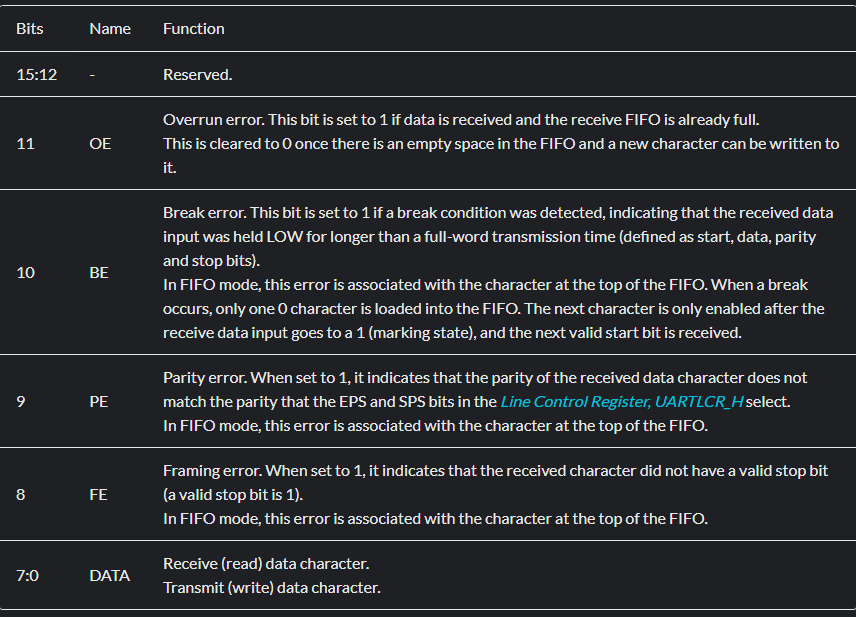
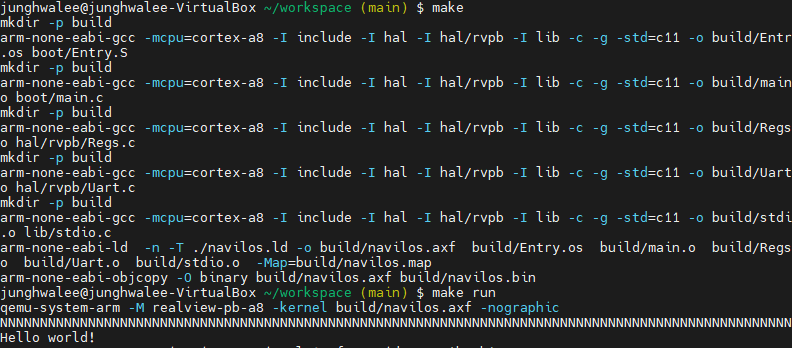

# 5. UART
-> 비동기화 송수신 장치로, 데이터를 직렬로 송수신  
-> RealViewPB = PL011(UARt controller)  

-> 콘솔 입출력용으로 주로 사용  

👉 **실행 파일 형식 메모리**  

### 5.1 UART 출력하기   
-> 입출력 기능만 구현 할 것 !!  
1. UART 하드웨어의 레지스터를 코드로 변환하기  
`UART 레지스터 참고 문서`  
https://developer.arm.com/documentation/ddi0183/g/programmers-model/register-descriptions/data-register--uartdr?lang=en  
- `UARTDAR` : 데이터 레지스터  
  
-[7:0] 8bit data register = 1byte씩 통신할 수 있는 하드웨어  
-[11:8] error register  

--> `hal/rpvb/Uart.h` 추가: 구조체로 표현
```c
typedef union UARTDR_t
{
    uint32_t all;
    struct {
        uint32_t DATA : 8;    // 7:0
        uint32_t FE : 1;      // 8
        uint32_t PE : 1;      // 9
        uint32_t BE : 1;      // 10
        uint32_t OE : 1;      // 11
        uint32_t reserved : 20;
    } bits;
} UARTDR_t;

```

2. Uart 관련 기능 함수 구현  
--> `hal/rpvb/Regs.c` 추가 : Uart 하드웨어 제어할 수 있는 변수 선언   
--> `hal/rpvb/Uart.c` 추가: 개발 보드에 맞는 UART 공용 HAL 인터페이스 구현 + `Uart.h` 헤더파일 추가 (이 헤더파일 참고해서)    

3. Main문 구현  
 `boot/Main.c` : main문에서 UART 출력 확인  

4. Makefile 수정  
```Makefile
#ARCH = armv7-a
MCPU = cortex-a8

TARGET = rvpb

# toolchain : 크로스 컴파일에 관여하는 유틸리티들
CC = arm-none-eabi-gcc
AS = arm-none-eabi-as 
LD = arm-none-eabi-ld 
OC = arm-none-eabi-objcopy

LINKER_SCRIPT = ./navilos.ld
MAP_FILE = build/navilos.map

ASM_SRCS = $(wildcard boot/*.S)
# 확장자 S인 파일을 모두 찾아 object로 변경 및 디렉터리도 build로
ASM_OBJS = $(patsubst boot/%.S, build/%.os, $(ASM_SRCS))

VPATH = boot \
		hal/$(TARGET)

C_SRCS = $(notdir $(wildcard boot/*.c))
C_SRCS += $(notdir $(wildcard hal/$(TARGET)/*.c))
C_OBJS = $(patsubst %.c, build/%.o, $(C_SRCS))

INC_DIRS = -I include	\
		   -I hal		\
		   -I hal/$(TARGET)

CFLAGS = -c -g -std=c11

navilos = build/navilos.axf
navilos_bin = build/navilos.bin

.PHONY: all clean run debug gdb

all: $(navilos)

clean:
	@rm -fr build

run: $(navilos)
	qemu-system-arm -M realview-pb-a8 -kernel $(navilos) -nographic

debug: $(navilos)
	qemu-system-arm -M realview-pb-a8 -kernel $(navilos) -S -gdb tcp::1234

gdb:
	gdb-multiarch

$(navilos): $(ASM_OBJS)	$(C_OBJS) $(LINKER_SCRIPT)
	$(LD) -n -T $(LINKER_SCRIPT) -o $(navilos) $(ASM_OBJS) $(C_OBJS)	-Map=$(MAP_FILE)
	$(OC) -O binary $(navilos) $(navilos_bin)

build/%.os: %.S
	mkdir -p $(shell dirname $@)
	$(CC) -mcpu=$(MCPU) $(INC_DIRS) $(CFLAGS) -o $@ $<

build/%.o: %.c
	mkdir -p $(shell dirname $@)
	$(CC) -mcpu=$(MCPU) $(INC_DIRS) $(CFLAGS) -o $@ $<
```
4. 실행
```
junghwalee@junghwalee-VirtualBox ~/workspace (main) $ make
mkdir -p build
arm-none-eabi-gcc -mcpu=cortex-a8 -I include -I hal -I hal/rvpb -c -g -std=c11 -o build/Entry.os boot/Entry.S
mkdir -p build
arm-none-eabi-gcc -mcpu=cortex-a8 -I include -I hal -I hal/rvpb -c -g -std=c11 -o build/main.o boot/main.c
mkdir -p build
arm-none-eabi-gcc -mcpu=cortex-a8 -I include -I hal -I hal/rvpb -c -g -std=c11 -o build/Regs.o hal/rvpb/Regs.c
mkdir -p build
arm-none-eabi-gcc -mcpu=cortex-a8 -I include -I hal -I hal/rvpb -c -g -std=c11 -o build/Uart.o hal/rvpb/Uart.c
arm-none-eabi-ld  -n -T ./navilos.ld -o build/navilos.axf  build/Entry.os  build/main.o  build/Regs.o  build/Uart.o -Map=build/navilos.map
arm-none-eabi-objcopy -O binary build/navilos.axf build/navilos.bin
junghwalee@junghwalee-VirtualBox ~/workspace (main) $ make run
qemu-system-arm -M realview-pb-a8 -kernel build/navilos.axf -nographic
NNNNNNNNNNNNNNNNNNNNNNNNNNNNNNNNNNNNNNNNNNNNNNNNNNNNNNNNNNNNNNNNNNNNNNNNNNNNNNNNNNNNNNNNNNNNNNNNNNNNqemu-system-arm: terminating on signal 15 from pid 3707 (bash)
```  

✅ **UART 공용 인터페이스 구현**  
`HAL(Hardware Abstraction Layer)`: 하드웨어에 직접 접근하지 않고, 추상화된 공용 API를 통해 장치 제어가 가능하도록 해주는 계층  
* 펌웨어 바이너리를 만들 때, 여러 C 소스파일 중에서 현재 타깃에 맞는 하드웨어의 C 소스 파일만 컴파일해서 사용하는 것이 중요하다.  

--> `Hal/HalUart.h` : 이것이 바로 UART 공용 HAL 인터페이스 선언부!  
- 보드가 무엇이든 상위 어플리케이션은 이 헤더만 보고 개발  

--> `Hal/rpvb/Uart.c`: 개발 보드에 맞는 UART 공용 HAL 인터페이스 구현부!  

### 5.2 안녕 세상!  
-> 문자열 출력해보기 !  
1. lib 폴더 문자열 출력 함수 작성  
-> `stdio.h` + `stdio.c` 추가 = `putstr(const char *s)`

2. main 문 수정
```c
#include "stdint.h"
#include "HalUart.h"

#include "stdio.h"
static void HW_init(void);

void main(void)
{
    HW_init();

    uint32_t i = 100;
    while (i--) {
        Hal_uart_put_char('N');
    }
    Hal_uart_put_char('\n');

    putstr("Hello world!\n");
}

static void HW_init(void)
{
    Hal_uart_init();
} 
```  

3. makefile 수정
```Makefile

# 소스 찾는 경로 lib 추가
VPATH = boot \
		hal/$(TARGET)	\
		lib

INC_DIRS = -I include	\
		   -I hal		\
		   -I hal/$(TARGET)	\
		   -I lib

C_SRCS += $(notdir $(wildcard lib/*.c))
```  

4. 실행  


### 5.3 UART로 입력 받기  
-> 받기 버퍼가 채워져 있는지 확인한 다음, 받기 버퍼에 데이터가 있으면 데이터 레지스터를 통해서 데이터를 읽어오기 !  

1. `Uart.c` 파일 수정 : `Hal_uart_get_char()` 추가  
```c

void Hal_uart_get_char(void)
{
    uint32_t data;

    while (Uart->uartfr.bits.RXFE);

    data = Uart->uartdr.all; // 레지스터 접근

    // Check for an error flag
    if (data & 0xFFFFFF00) // FE, PE, BE, OE (error flag -> 1이면 error)
    {
        // Clear the error
        Uart->uartrsr.all = 0xFF; // 레지스터 접근
        return 0;
    }

    return (uint8_t)(data & 0xFF);
}
```
-> 한 글자 입력 받는 함수  
-> 총 2번의 레지스터 접근밖에 하지 않기에, 최적화된 코드  

* 어셈블리어 참고    
-> 한 명령어가 32bit이므로, 바이너리 바이트 오프셋은 4씩 커짐을 확인
```asm  

junghwalee@junghwalee-VirtualBox ~/workspace/build (main) $ arm-none-eabi-objdump -d Uart.o

Uart.o:     file format elf32-littlearm


Disassembly of section .text:

00000000 <Hal_uart_init>:
   0:   e52db004        push    {fp}            @ (str fp, [sp, #-4]!)
   4:   e28db000        add     fp, sp, #0
   8:   e3003000        movw    r3, #0
   c:   e3403000        movt    r3, #0
  10:   e5932000        ldr     r2, [r3]
  14:   e5923030        ldr     r3, [r2, #48]   @ 0x30
  18:   e3c33001        bic     r3, r3, #1
  1c:   e5823030        str     r3, [r2, #48]   @ 0x30
  20:   e3003000        movw    r3, #0
  24:   e3403000        movt    r3, #0
  28:   e5932000        ldr     r2, [r3]
  2c:   e5923030        ldr     r3, [r2, #48]   @ 0x30
  30:   e3833c01        orr     r3, r3, #256    @ 0x100
  34:   e5823030        str     r3, [r2, #48]   @ 0x30
  38:   e3003000        movw    r3, #0
  3c:   e3403000        movt    r3, #0
  40:   e5932000        ldr     r2, [r3]
  44:   e5923030        ldr     r3, [r2, #48]   @ 0x30
  48:   e3833c02        orr     r3, r3, #512    @ 0x200
  4c:   e5823030        str     r3, [r2, #48]   @ 0x30
  50:   e3003000        movw    r3, #0
  54:   e3403000        movt    r3, #0
  58:   e5932000        ldr     r2, [r3]
  5c:   e5923030        ldr     r3, [r2, #48]   @ 0x30
  60:   e3833001        orr     r3, r3, #1
  64:   e5823030        str     r3, [r2, #48]   @ 0x30
  68:   e320f000        nop     {0}
  6c:   e28bd000        add     sp, fp, #0
  70:   e49db004        pop     {fp}            @ (ldr fp, [sp], #4)
  74:   e12fff1e        bx      lr

00000078 <Hal_uart_put_char>:
  78:   e52db004        push    {fp}            @ (str fp, [sp, #-4]!)
  7c:   e28db000        add     fp, sp, #0
  80:   e24dd00c        sub     sp, sp, #12
  84:   e1a03000        mov     r3, r0
  88:   e54b3005        strb    r3, [fp, #-5]
  8c:   e320f000        nop     {0}
  90:   e3003000        movw    r3, #0
  94:   e3403000        movt    r3, #0
  98:   e5933000        ldr     r3, [r3]
  9c:   e5933018        ldr     r3, [r3, #24]
  a0:   e7e032d3        ubfx    r3, r3, #5, #1
  a4:   e6ef3073        uxtb    r3, r3
  a8:   e3530000        cmp     r3, #0
  ac:   1afffff7        bne     90 <Hal_uart_put_char+0x18>
  b0:   e3003000        movw    r3, #0
  b4:   e3403000        movt    r3, #0
  b8:   e5933000        ldr     r3, [r3]
  bc:   e55b2005        ldrb    r2, [fp, #-5]
  c0:   e5832000        str     r2, [r3]
  c4:   e320f000        nop     {0}
  c8:   e28bd000        add     sp, fp, #0
  cc:   e49db004        pop     {fp}            @ (ldr fp, [sp], #4)
  d0:   e12fff1e        bx      lr

000000d4 <Hal_uart_get_char>:
  d4:   e52db004        push    {fp}            @ (str fp, [sp, #-4]!)
  d8:   e28db000        add     fp, sp, #0
  dc:   e24dd00c        sub     sp, sp, #12
  e0:   e320f000        nop     {0}
  e4:   e3003000        movw    r3, #0
  e8:   e3403000        movt    r3, #0
  ec:   e5933000        ldr     r3, [r3]
  f0:   e5933018        ldr     r3, [r3, #24]
  f4:   e7e03253        ubfx    r3, r3, #4, #1
  f8:   e6ef3073        uxtb    r3, r3
  fc:   e3530000        cmp     r3, #0
 100:   1afffff7        bne     e4 <Hal_uart_get_char+0x10>
 104:   e3003000        movw    r3, #0
 108:   e3403000        movt    r3, #0
 10c:   e5933000        ldr     r3, [r3]
 110:   e5933000        ldr     r3, [r3]
 114:   e50b3008        str     r3, [fp, #-8]
 118:   e51b3008        ldr     r3, [fp, #-8]
 11c:   e35300ff        cmp     r3, #255        @ 0xff
 120:   9a000005        bls     13c <Hal_uart_get_char+0x68>
 124:   e3003000        movw    r3, #0
 128:   e3403000        movt    r3, #0
 12c:   e5933000        ldr     r3, [r3]
 130:   e3a020ff        mov     r2, #255        @ 0xff
 134:   e5832004        str     r2, [r3, #4]
 138:   ea000000        b       140 <Hal_uart_get_char+0x6c>
 13c:   e320f000        nop     {0}
 140:   e28bd000        add     sp, fp, #0
 144:   e49db004        pop     {fp}            @ (ldr fp, [sp], #4)
 148:   e12fff1e        bx      lr
```  
2. main 함수 수정: 입력받는 함수 예제  

```c
void main(void)
{
    HW_init();

    i = 50;
    while (i--) {
        uint8_t ch = Hal_uart_get_char();
        Hal_uart_put_char(ch);
    }
} 
```  

### 5.4 printf 만들기  
1. `stdio.h`에 `debug_printf()` 선언  
2. `stdarg.h` 헤더파일 추가: 가변 인자 함수 구현할 때 사용되는 매크로 (컴파일러의 빌트인 함수)
3. `stdio.c`에 `vsprintf` 추가
```c
uint32_t vsprintf(char* buf, const char* format, va_list arg)
{
    uint32_t c = 0;

    char        ch; // %c
    char* str; // %s
    uint32_t    uint; // %u
    uint32_t    hex; // %x

    for (uint32_t i = 0; format[i]; i++)
    {
        if (format == '%') {
            i++;
            switch (format[i]) {
            case 'c':
                ch = (char)va_arg(arg, int32_t);
                buf[c++] = ch;
                break;
            case 's':
                str = (char*)va_arg(arg, char*);
                if (str == NULL) { // 널 포인터 에러 처리
                    str = "(null)";
                }
                while (*str)
                {
                    buf[c++] = (*str++);
                }
                break;
            case 'u':
                uint = (uint32_t)va_arg(arg, uint32_t);
                c += utoa(&buf[c], uint, utoa_dec);
                break;
            case 'x':
                hex = (uint32_t)va_arg(arg, uint32_t);
                c += utoa(&buf[c], hex, uota_hex);
                break;
            }
        }
        else {
            buf[c++] = format[i];
        }
    }

    if (c >= PRINTF_BUF_LEN) {
        buf[0] = '\0';
        return 0;
    }

    buf[c] = '\0';
    return c;
}
```
4. `stdio.h`와 `stdio.c`에 `utoa()` 추가 : unsigned int -> string
```c
uint32_t utoa(char* buf, uint32_t val, utoa_t base)
{
    uint32_t c = 0;
    int32_t idx = 0;
    char tmp[11]; // it is big enough for store 32bit int

    do {
        uint32_t t = val % (uint32_t)base; // base = type(decimal or hex)
        // if (t >= 10) {
        //     t += 'A' - '0' - 10; // 10 ~ 15는 'A' ~ 'F'로 변환
        // }
        // tmp[idx] = (t + '0'); // 숫자를 문자로 변환하여 저장
        tmp[idx] = (t < 10) ? (t + '0') : (t - 10 + 'A');
        val /= base; // 다음 자릿수로 이동
        idx++;
    } while (val);

    // reverse
    idx--;
    while (idx >= 0) {
        buf[c++] = tmp[idx];
        idx--;
    }

    return c;
}
```  
5. `main`에 debug_printf 추가해서 확인  
-> Printf_test() 추가  
6. Makefile 수정 
- 나누기, 나머지 연산 가능하도록  
-> ARM은 기본적으로 나누기와 나머지 지원하는 하드웨어가 없어, 표준 라이브러리에서 제공하는 함수로 링킹 해주어야함!  
```
junghwalee@junghwalee-VirtualBox ~/workspace (main) $ make
mkdir -p build
arm-none-eabi-gcc -mcpu=cortex-a8 -I include -I hal -I hal/rvpb -I lib -c -g -std=c11 -o build/stdio.o lib/stdio.c
lib/stdio.c: In function 'vsprintf':
lib/stdio.c:42:20: warning: comparison between pointer and integer
   42 |         if (format == '%') {
      |                    ^~
arm-none-eabi-ld  -n -T ./navilos.ld -o build/navilos.axf  build/Entry.os  build/main.o  build/Regs.o  build/Uart.o  build/stdio.o      -Map=build/navilos.map
arm-none-eabi-ld: build/stdio.o: in function `utoa':
/home/junghwalee/workspace/lib/stdio.c:90:(.text+0x360): undefined reference to `__aeabi_uidivmod'
arm-none-eabi-ld: /home/junghwalee/workspace/lib/stdio.c:96:(.text+0x3b8): undefined reference to `__aeabi_uidiv'
```  
- 수정 사항  
```Makefile
LD = arm-none-eabi-gcc

# 시스템 기본 라이브러리 링크 안하기  
# -nostartfiles: C 런타임이 제공하는 시작코드 포함 안함
# -nostdlib : 표준 라이브러리 사용 안 함
# -nodefaultlibs: 기본 링크되는 표준 라이브러리들 제외
# GCC 내부 지원 함수 사용
# -lgcc : 산술 연산이나 예외처리 등 GCC 내부 함수들이 필요할 수 있어서, 명시적으로 링크
LDFLAGS = -nostarfiles -nostdlib -nodefaultlibs -static -lgcc

$(navilos): $(ASM_OBJS)	$(C_OBJS) $(LINKER_SCRIPT)
	$(LD) -n -T $(LINKER_SCRIPT) -o $(navilos) $(ASM_OBJS) $(C_OBJS)	-Wl,-Map=$(MAP_FILE) $(LDFLAGS)
	$(OC) -O binary $(navilos) $(navilos_bin)
```  

*실행 결과*
```
junghwalee@junghwalee-VirtualBox ~/workspace (main) $ make run
qemu-system-arm -M realview-pb-a8 -kernel build/navilos.axf -nographic
NNNNNNNNNNNNNNNNNNNNNNNNNNNNNNNNNNNNNNNNNNNNNNNNNNNNNNNNNNNNNNNNNNNNNNNNNNNNNNNNNNNNNNNNNNNNNNNNNNNN
Hello world!
Hello printf
output string pointer: printf pointer test
(null) is null pointer, 10 number
5 = 5
dec = 255 hex = FF
print zero 0
SYSCTRL0 0
```


