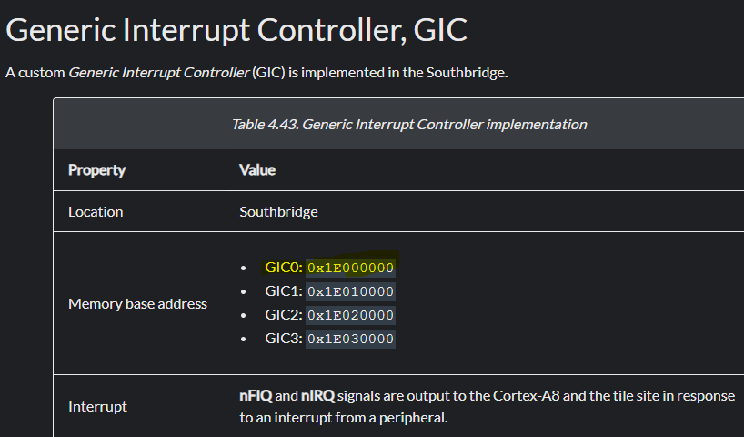
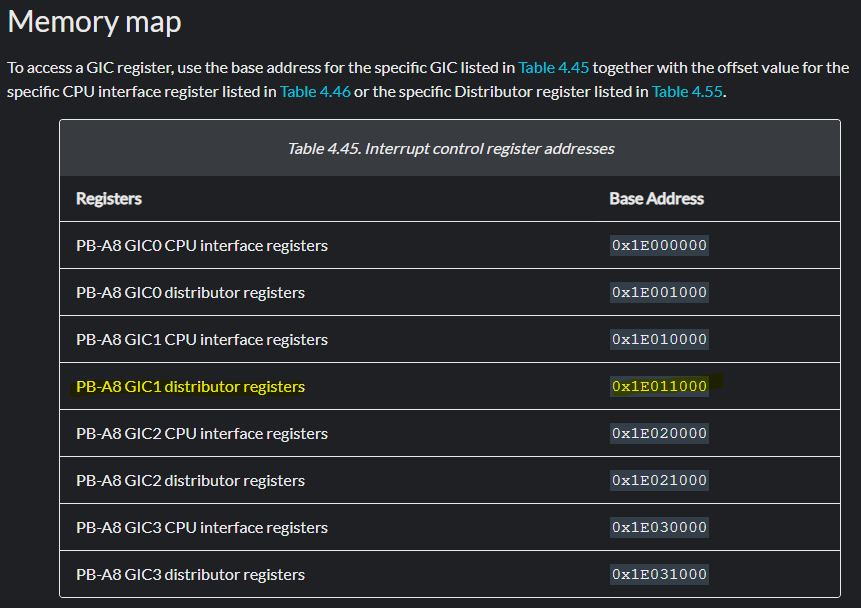
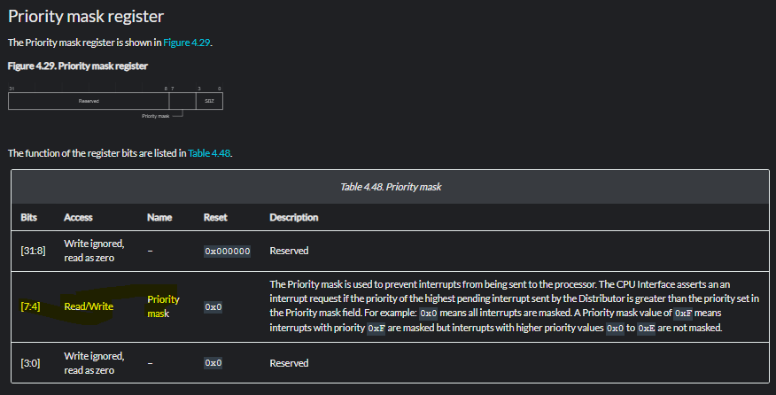
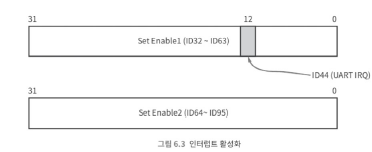

# 6. 인터럽트
`인터럽트`란?  
- CPU가 프로그램을 순차적으로 실행하는 도중, 갑작스럽게 발생한 사건(외부 신호 등)을 즉시 처리하기 위해 현재 실행 흐름을 잠시 중단시키고, 해당 사건 처리 루틴으로 제어를 넘기는 매커니즘.  

인터럽트 처리를 위해서는 `인터럽트 컨트롤러`를 초기화하고 사용하는 코드 작성 필요 -> 실제 인터럽트를 발생시키는 하드웨어와 인터럽트 컨트롤러를 연결  

👉 **ARM 기반 MCU에서 인터럽트 처리 과정**  
`하드웨어 → 인터럽트 컨트롤러 → CPU 예외 발생 → 핸들러 실행`  

1. 하드웨어 이벤트 발생
- 해당 하드웨어는 인터럽트 요청 (IRQ 신호 / FIQ 신호)을 인터럽트 컨트롤러에 전달  

2. 인터럽트 컨트롤러 
- 여러 장치에서 올라온 인터럽트를 관리  
- 선택된 인터럽트를 CPU(코어)에 전달  

3. CPU (ARM 코어)  
- `CPSR` 레지스터의 I(IRQ Mask), F(FIQ Mask) 비트 상태 확인  
    - `I=0` -> IRQ  허용
    - `F=0` -> FIQ 허용  
- 허용 상태라면 Exception 발생으로 간주하고 PC를 해당 Exception vector로 jump  

4. Exception Vector -> 핸들러 실행  
- ARM은 인터럽트 종류별로 고정된 주소(예외 벡터 테이블)을 갖고 있음  
- 벡터 주소에 작성된 익셉션 핸들러 코드로 제어가 이동  
이때 CPU는 일부 레지스터(PC, CPSR 등)을 스택이나 전용 모드 레지스터에 저장  

5. 인터럽트 서비스 루틴(ISR, 핸들러)  
- 펌웨어에서 작성하는 부분  
    1. 컨텍스트 저장(일부 레지스터 푸시)  
    2. 인터럽트 발생 원인 확인 (UART의 RT/TX 상태 레지스터 읽기)  
    3. 해당 작업 처리 (데이터 읽기/쓰기, 플래그 클리어)  
    4. 컨텍스트 복원  
    5. eret등으로 원래 코드로 복귀

6. 원래 실행중이던 프로그램 복귀  
- ISR 수행 끝나면 저장해두었던 레지스터 상태 복원하고 중단했던 지점부터 정상 실행을 이어감.  

### 6.1 인터럽트 컨트롤러  
- RealViewPB에서는 인터럽트 컨트롤러를 `GIC(Generic Intterrupt Controller)`라 부른다.  

1. GIC 레지스터 구조체 만들기
```C
// CPU Interface Registers
typedef struct GicCput_t
{
    CpuControl_t       cpucontrol;        //0x000
    PriorityMask_t     prioritymask;      //0x004
    BinaryPoint_t      binarypoint;       //0x008
    InterruptAck_t     interruptack;      //0x00C
    EndOfInterrupt_t   endofinterrupt;    //0x010
    RunningInterrupt_t runninginterrupt;  //0x014
    HighestPendInter_t highestpendinter;  //0x018
} GicCput_t;

// Distributor registers
typedef struct GicDist_t
{
    DistributorCtrl_t   distributorctrl;    //0x000
    ControllerType_t    controllertype;     //0x004
    uint32_t            reserved0[62];      //0x008-0x0FC
    uint32_t            reserved1;          //0x100
    uint32_t            setenable1;         //0x104
    uint32_t            setenable2;         //0x108
    uint32_t            reserved2[29];      //0x10C-0x17C
    uint32_t            reserved3;          //0x180
    uint32_t            clearenable1;       //0x184
    uint32_t            clearenable2;       //0x188
} GicDist_t;

#define GIC_CPU_BASE  0x1E000000  //CPU interface
#define GIC_DIST_BASE 0x1E001000  //distributor

```  

  
- 각 CPU interface / distributor 주소 memory map과 일치  
- CPU interface (GICC): Distributor가 특정 CPU로 보낸 인터럽트를 실제 CPU가 받아 처리할 수 있도록 연결  
- 인터럽트를 배분하는 역할  

2. Hal/Regs.c에 GIC의 레지스터 인스턴스 2개 생성  
```C
#include "Interrupt.h"

volatile GicCput_t* GicCpu = (GicCput_t*)GIC_CPU_BASE;
volatile GicDist_t* GicDist = (GicDist_t*)GIC_DIST_BASE;
```

3. Hal/HalInterrupt.h 파일 추가하여 인터럽트 API 설계  
```C
void Hal_interrupt_init(void); // 초기화
void Hal_interrupt_enable(uint32_t interrupt_num); // 활성화
void Hal_interrupt_disable(uint32_t interrupt_num); // 비활성화
void Hal_interrupt_register_handler(InterHdlr_fptr handler, uint32_t interrupt_num); // 개별 인터럽트 별로 따로 연결해야 하는 인터럽트 핸들러 등록
void Hal_interrupt_run_handler(void); // 개별 인터럽트의 핸들러를 IRQ / FIQ로 구분해서 인터럽트 핸들러 실행
```  

4. Hal/rvpb/Interrupt.c 설계한 API 내용 구현  

1. `Hal_interrupt_init()`  
- CPU interface / Distributor 레지스터 모두 on  
- Interrupt 키기 위해 Priority mask 0xF로 설정  
- Handler 함수 모두 초기화  

**`enable_irq()` 추가 방법**  
-> cpsr의 IRQ 마스크를 끄는 코드  
1. `/lib/armcpu.h` / `/lib/armcpu.c` 내용 추가
- IRQ / FIQ 키고 끄는 함수   
- cpsr을 제어하려면 어셈블리어를 사용할 수 밖에 없기 때문에 
    1. 어셈블리어 소스 파일 만들어 완전히 어셈블리어로 작성
    2. C언어 소스 파일을 만들고 C언어 함수 속에서 인라인 어셈블리어를 사용하는 방법 -> 이걸로 작성 예정  
    ->장점: 스택에 레지스터를 백업 및 복구하는 코드와 리턴 처리하는 코드를 컴파일러가 자동으로 만듬. 
* BIC는 1이 있는 비트에 0을 쓰고, ORR은 반대로 1을 쓴다. 

**priority mask**  
  
- 4번부터 7번 비트까지만 의미가 있어, 모두 0으로 설정하면 모든 인터럽트를 다 마스크해버림 = 즉 모든 인터럽트를 막음. 
- 4번부터 7번 비트까지를 0xF로 설정하면 인터럽트의 우선순위가 0x0부터 0xE까지인 인터럽트를 허용한다는 의미 -> 우선순위의 기본값은 0이므로 실제로는 모든 인터럽트를 다 허용  

2. `Hal_interrupt_enable` / `Hal_interrupt_disable`  

  

- 특정 IRQ ID를 받아 해당 인터럽트를 Enable / disable 하도록 GIC 레지스터에 반영  
- GIC는 총 64개의 인터럽트를 관리
    - 한 레지스터(Set Enable)가 32개의 인터럽트를 담당
    - `SetEnable1` → IRQ32 ~ IRQ63  
    - `SetEnable2` → IRQ64 ~ IRQ95  
- 따라서 원하는 비트 오프셋을 구하려면 IRQ 번호에서 32를 빼야 함  
- 이 계산을 자동화한 알고리즘을 Hal_interrupt_enable/disable 함수에 구현 → 드라이버는 IRQ 번호만 전달하면 알아서 레지스터/비트 위치 계산 후 반영    

3. `Hal_interrupt_register_handler()` / `Hal_interrupt_run_handler()`  
- 인터럽트 핸들러를 처리하는 함수
- `Hal_interrupt_register_handler`: 인터럽트 핸들러 함수에 등록하는 함수  
- `Hal_interrupt_run_handler` : 인터럽트 핸들러 실행하는 함수


